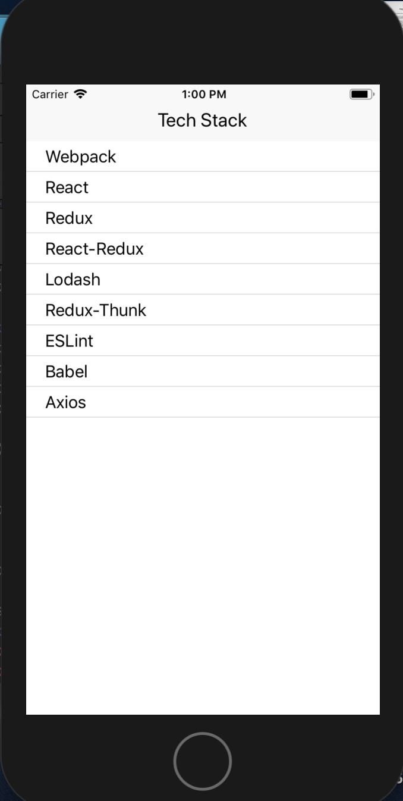
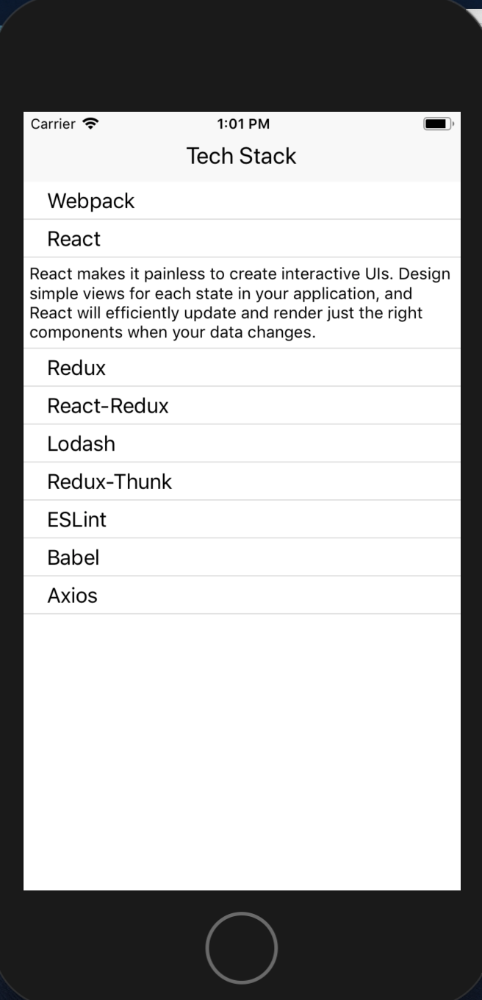

#react-native-redux-list

App created to allow users to view a list and click on an item and using animation have it pop open. Created in an Udemy course with Stephen Grider. Integrating React Native and Redux.

To run the program:

1.  clone repo and run npm install

2.  To run on iphone: react-native run-ios
    To run on android: react-native run-android

Page once click on item--> Uses redux to get props

